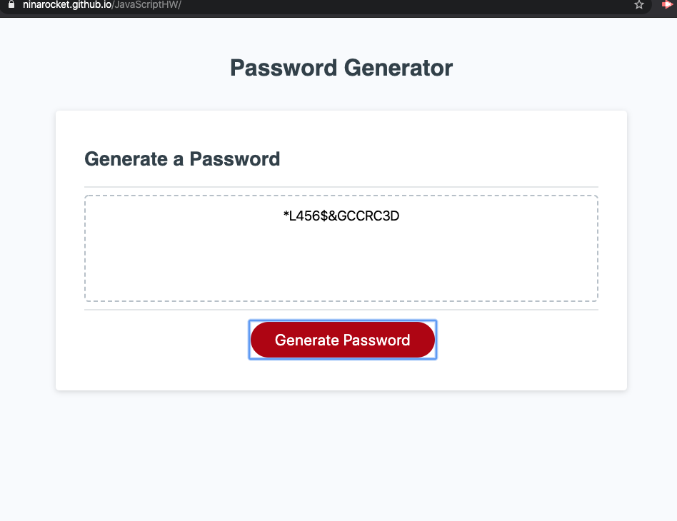
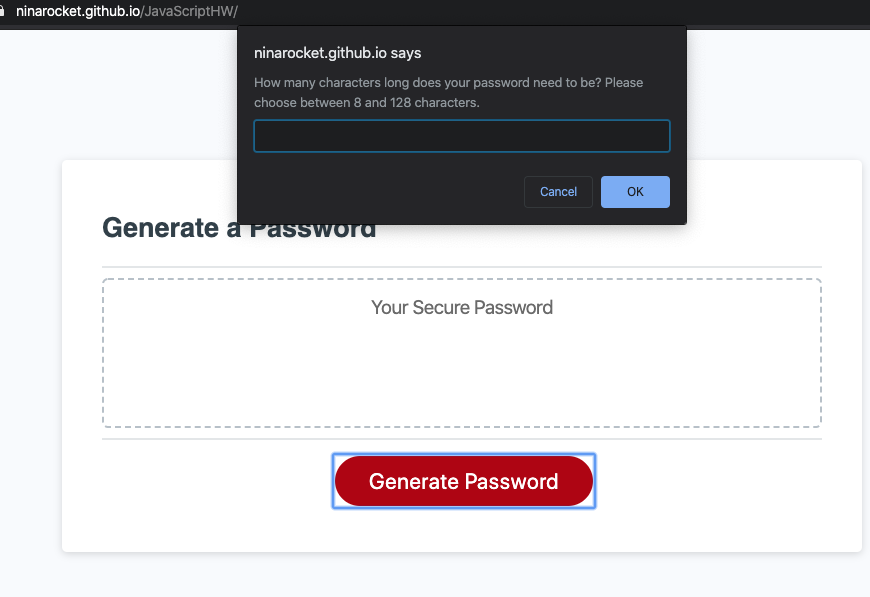

# JavaScriptHW
This website will generate a password following user input criteria. A series of prompts will be presented that the user will respond to in order to define what their password must include. The user will determine the password length so long that it is between 8 and 128 characters. The user will then respond to the prompt if they will need special characters, lowercase characters, uppercase characters, and/or numbers.

When the user visits the website, they will see an empty textfield and a generate password button:

The user will then click the Generate Password button to begin the process. The first prompt will ask the user the length that their password will be:

If the length is outside of the range (less than 8 characters or more than 128 characters) they will be alerted of the error and asked again:

Once the length within the acceptable bounds have been reached, a series of prompts will ask the user to enter a letter corresponding to the character type needed. They will be first asked if they need special characters, then lowercase, uppercase, and finally numeric characters. Below is an example of the user being asked if they need special characters and the user pressing s. If the user does not need the criteria, they will press "enter" to continue to the next prompt.

Finally, when the user has answered all prompts, a password is generated and displayed in the text field. This is an example of a password the user selected with 14 characters and needing special, uppercase, and numeric character types:

